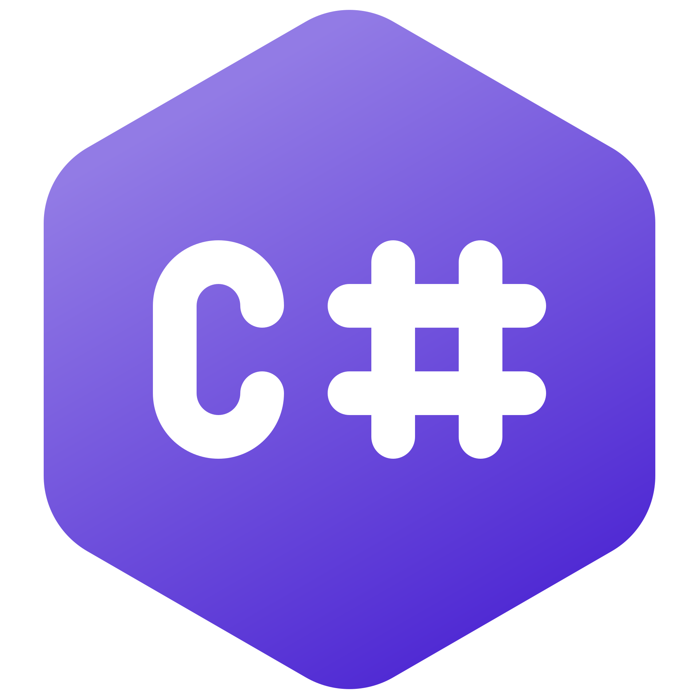

## Hi there, it's Derek 👋

<!--
**DerekGusatto02/DerekGusatto02** is a ✨ _special_ ✨ repository because its `README.md` (this file) appears on your GitHub profile.

Here are some ideas to get you started:

- 🔭 I’m currently working on ...
- 🌱 I’m currently learning ...
- 👯 I’m looking to collaborate on ...
- 🤔 I’m looking for help with ...
- 💬 Ask me about ...
- 📫 How to reach me: ...
- 😄 Pronouns: ...
- ⚡ Fun fact: ...
-->

### 💻 Computer Sciente Student at University of Padua
### 👨🏼‍💻 Software developer at [aKite](https://akite.net)

#### 📫 How to reach me: [contact list](https://linktr.ee/derekgusatto)

### Languages and Tools 
Thanks to my studies and my work I have learned several
- Programming languages: 

- Frameworks:

- Tools:

